# IIPr1 - Introducción a C# en Unity

- **Ejercicio 1 — Cambio de color periódico:** El script `ColorChange` cambia el color del objeto usando un vector RGB inicial aleatorio y, cada `waitFrames` fotogramas, modifica al azar una componente (R, G o B). Parámetro visible en el Inspector: `waitFrames`.
	- Script: [scripts/ColorChange.cs](scripts/ColorChange.cs)
	- Gif de ejecución: 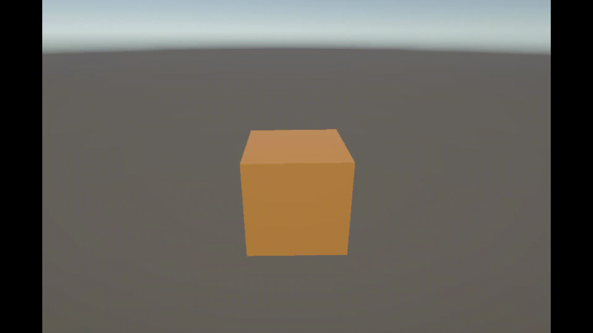
- **Ejercicio 2 — Operaciones con vectores:** El script `Vectors` expone dos `Vector3` públicos (`vector1`, `vector2`) y calcula:
	- Magnitud de cada vector (`magnitude1`, `magnitude2`).
	- Ángulo entre ambos (`angle`).
	- Distancia (`distance`).
	- Qué vector está a mayor altura (`highestVector`).
	- Todos los resultados se muestran por consola y en el Inspector.
	- Script: [scripts/Vectors.cs](scripts/Vectors.cs)
	- Gif de ejecución: 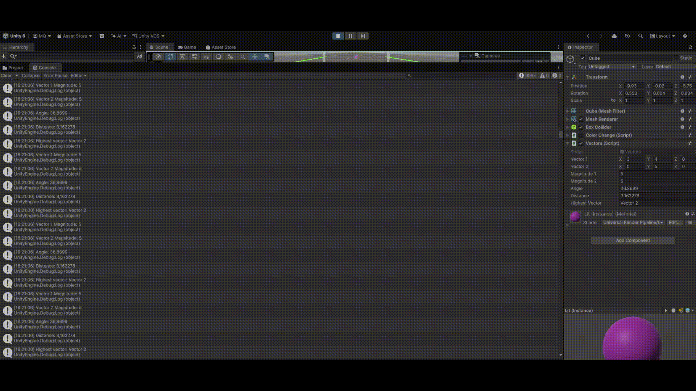
- **Ejercicio 3 — Posición de la esfera en pantalla:** El script `SpherePosition` dibuja en pantalla la posición actual del `Transform` de la esfera usando `OnGUI`.
	- Script: [scripts/SpherePosition.cs](scripts/SpherePosition.cs)
	- Gif de ejecución: 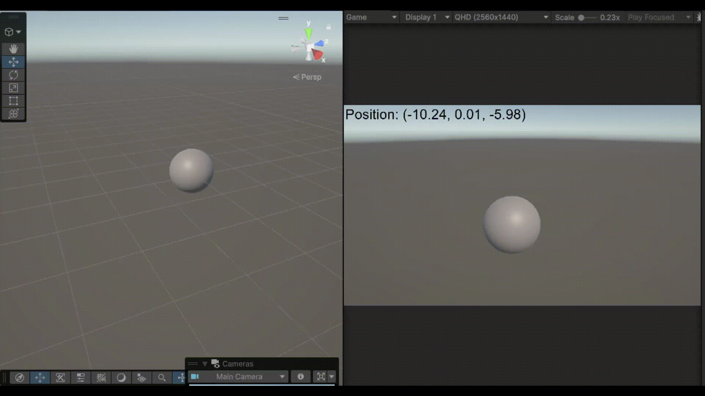
- **Ejercicio 4 — Distancia entre objetos:** El script `DistanceFrom` busca los objetos por etiqueta (`Sphere`, `Cube`, `Cylinder`) y calcula la distancia entre la esfera y el cubo / cilindro, mostrando el resultado en consola cada vez que cambia alguna posición.
	- Script: [scripts/DistanceFrom.cs](scripts/DistanceFrom.cs)
	- Gif de ejecución: 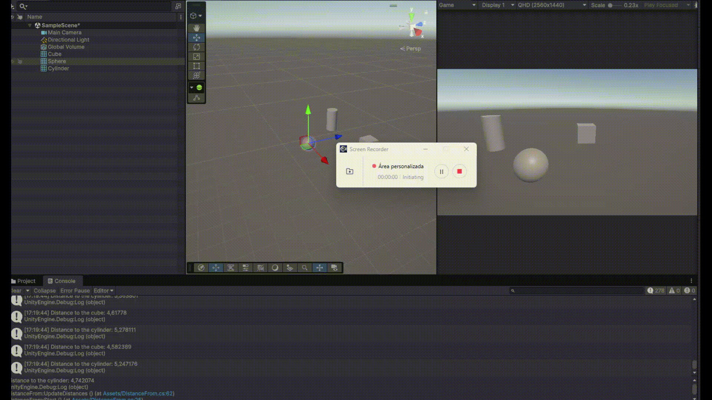
- **Ejercicio 5 — Movimiento de un objeto al pulsar el espacio:** El script `MoveObject` guarda la posición inicial del objeto y, cuando `Input.GetAxis("Jump") > 0`, lo desplaza según el vector `displacement` configurado en el Inspector.
	- Script: [scripts/MoveObject.cs](scripts/MoveObject.cs)
	- Gif de ejecución: 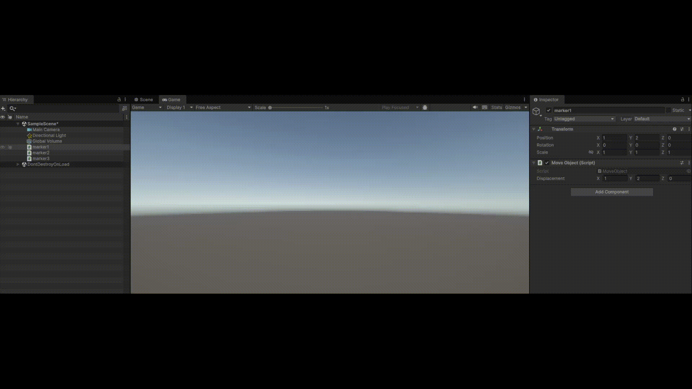
- **Ejercicio 6 — Velocidad del cubo con flechas:** El script `CubeSpeed` multiplica la velocidad por el valor del eje horizontal o vertical según la tecla pulsada y muestra los resultados por consola y por el Inspector.
	- Script: [scripts/CubeSpeed.cs](scripts/CubeSpeed.cs)
	- Gif de ejecución: 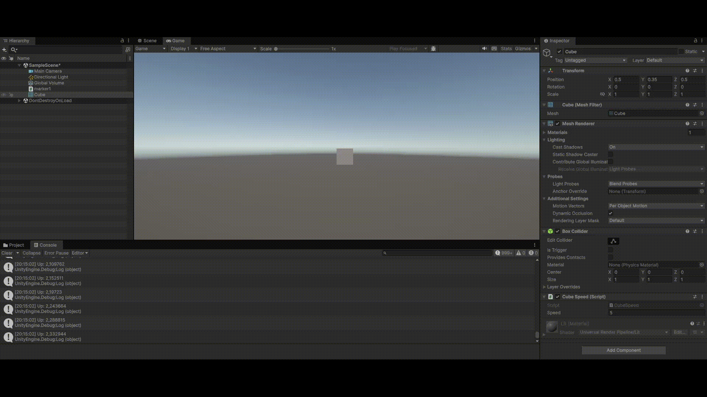
- **Ejercicio 7 — Configuración del Input Manager:** se definen los ejes del proyecto para inputs como `Fire1`, usando el `Input Manager` de Unity para preparar controles de teclado y ratón.
	- Configuración: Project Settings > Input Manager
	- Gif de ejecución: 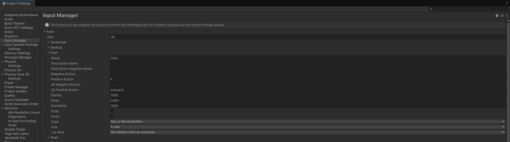
- **Ejercicio 8 — Movimiento del cubo con un vector de desplazamiento:** El script `MoveCube` mueve el objeto usando un `Vector3` (`moveDirection`) y una velocidad (`speed`) en cada frame.
	- Script: [scripts/MoveCube.cs](scripts/MoveCube.cs)
	- Gif de ejecución: 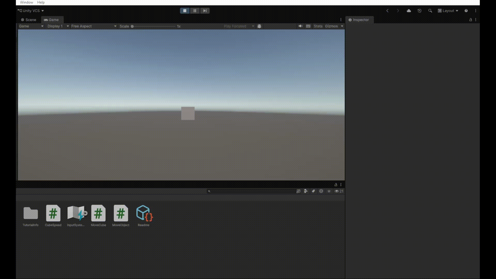
- **Ejercicio 9 — Movimiento del cubo con teclado:** El script `MoveCubeWithKeys` usa `Input.GetAxis("Horizontal")` y `Input.GetAxis("Vertical")` para desplazar el cubo en dos dimensiones.
	- Script: [scripts/MoveCubeWithKeys.cs](scripts/MoveCubeWithKeys.cs)
	- Gif de ejecución: 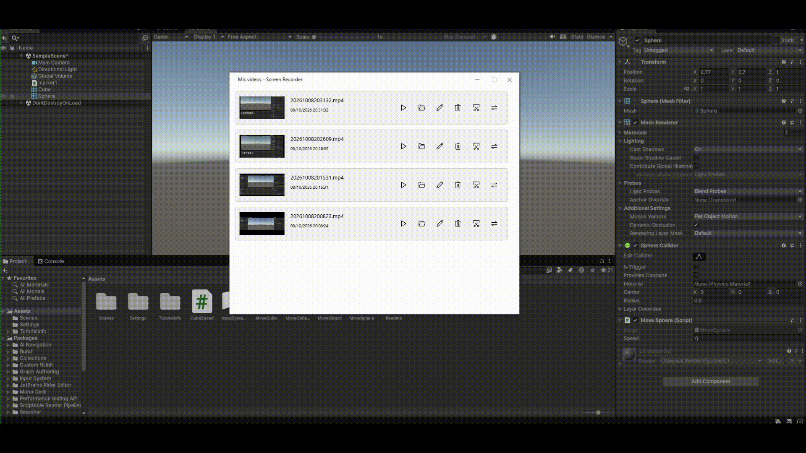
- **Ejercicio 10 — Movimiento con teclas corregido:** El script `MoveCubeWithKeysFix` corrige la lógica de entrada para que el movimiento del cubo sea continuo y estable al pulsar las teclas de dirección.
	- Script: [scripts/MoveCubeWithKeysFix.cs](scripts/MoveCubeWithKeysFix.cs)
	- Gif de ejecución: 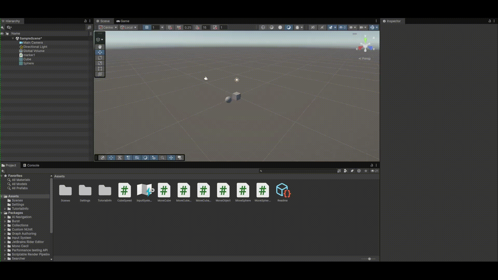
- **Ejercicio 11 — Seguimiento de una esfera:** El script `FollowSphere` hace que un objeto persiga a la esfera, manteniendo la altura constante y normalizando la dirección del movimiento.
	- Script: [scripts/FollowSphere.cs](scripts/FollowSphere.cs)
	- Gif de ejecución: 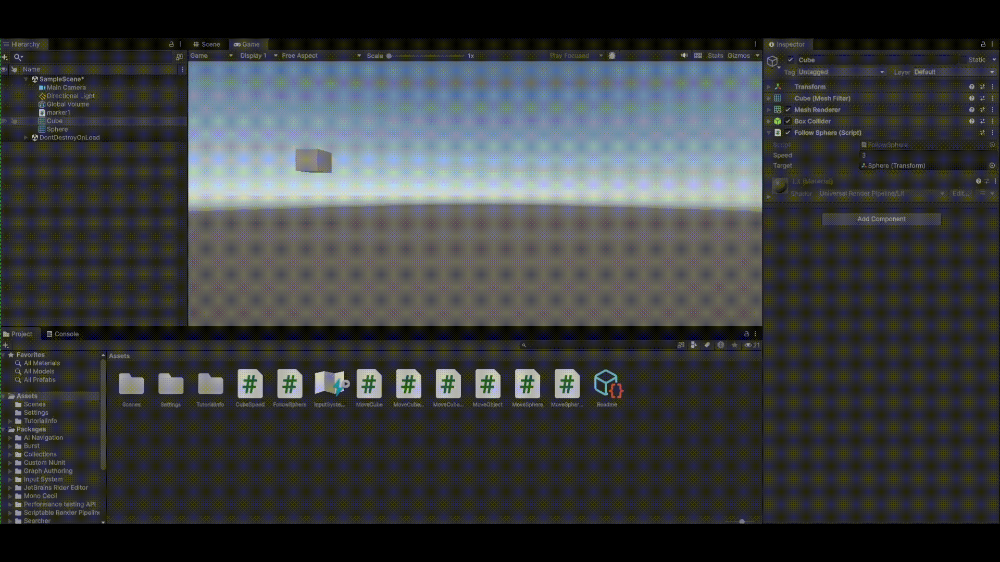
- **Ejercicio 12 — Seguimiento con rotación:** El script `FollowSphereWithRotation` usa `LookAt` para orientar el objeto hacia la esfera y desplazarlo a su velocidad configurada.
	- Script: [scripts/FollowSphereWithRotation.cs](scripts/FollowSphereWithRotation.cs)
	- Gif de ejecución: 
- **Ejercicio 13 — Movimiento de una esfera con WASD:** El script `MoveSphereWithKeysFix` detecta pulsaciones de `W`, `A`, `S` y `D` para mover la esfera en horizontal y vertical con una velocidad configurable.
	- Script: [scripts/MoveSphereWithKeysFix.cs](scripts/MoveSphereWithKeysFix.cs)
	- Gif de ejecución: 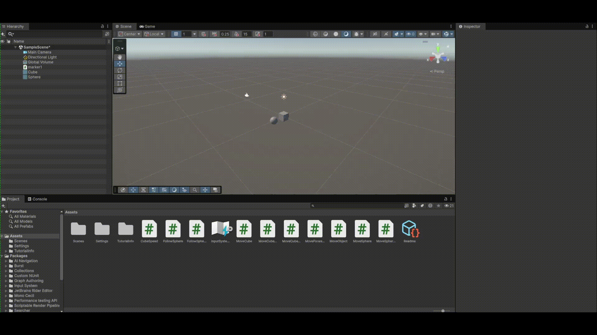

